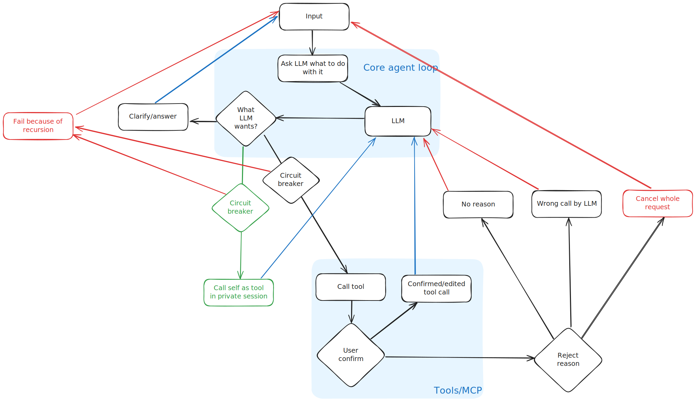

## Description
This is an AI agent that can work with multiple LLM models, MCP servers and AI providers that have OpenAI compatible completions API.

This is great tool for PoC/MVP purposes when you quickly have to play with integrations or test model performance.

## Features
- Chat with LLM model. You can change model, role, tools mid-converstaion which allows pretty neat scenarios
- Create customized agent roles via system prompts
- Use tools from MCP servers (both SSE and stdio)
- Builtin tool - Lua code execution when you need model to calculate something precisely
- Multiple chats in parallel

## Running
```
go mod tidy
go run main.go
```

By default it is a desktop application however you can run only the agent part as http server:
```
go run main.go --server --port 8008
```

## Server API
Server API is at https://unra73d.github.io/agent-smith/docs/

General flow is still designed for desktop app, not for ready-to-go microservice - connect to SSE endpoint to receive updates from server, use other APIs to call features.

## Architecture


The diagram above illustrates the internal workflow of the agent, detailing the steps it takes to process requests and generate responses.

## TODO
- Chat UI is flaky sometimes
- Calling self as a dynamic agent
- No automatic circuit breakers - user can manually stop generation
- You tell me

